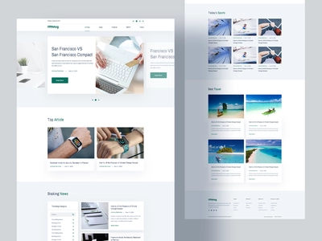
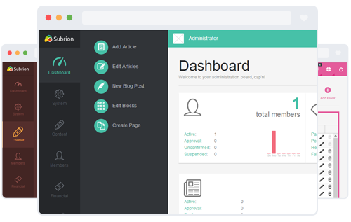

<!DOCTYPE html>
<html>
  <head>
    <meta charset="UTF-8">
  </head>
  <body>
    <h1>Blogs Website</h1>
    
This is my first full stack web development blog website with Flask in Python and HTML UI.

    
The website is deployed at: <a href="https://srenath-blogwebsite.herokuapp.com/">https://srenath-blogwebsite.herokuapp.com/</a>

    <h2>Features</h2>
    <ul>
      <li>User authentication and authorization</li>
      <li>Create, read, update, and delete blog posts</li>
      <li>Comment on blog posts</li>
      <li>Search for blog posts</li>
      <li>Admin dashboard for managing users and blog posts</li>
    </ul>
    <h2>Technology Stack</h2>
    <ul>
      <li>Flask</li>
      <li>HTML/CSS/JavaScript</li>
      <li>Bootstrap</li>
      <li>SQLAlchemy</li>
      <li>PostgreSQL</li>
    </ul>
    <h2>Output Examples</h2>
    <h3>Home Page</h3>
    
    <h3>Blog Post Page</h3>
    
    <h3>Admin Dashboard</h3>
    
  </body>
</html>
